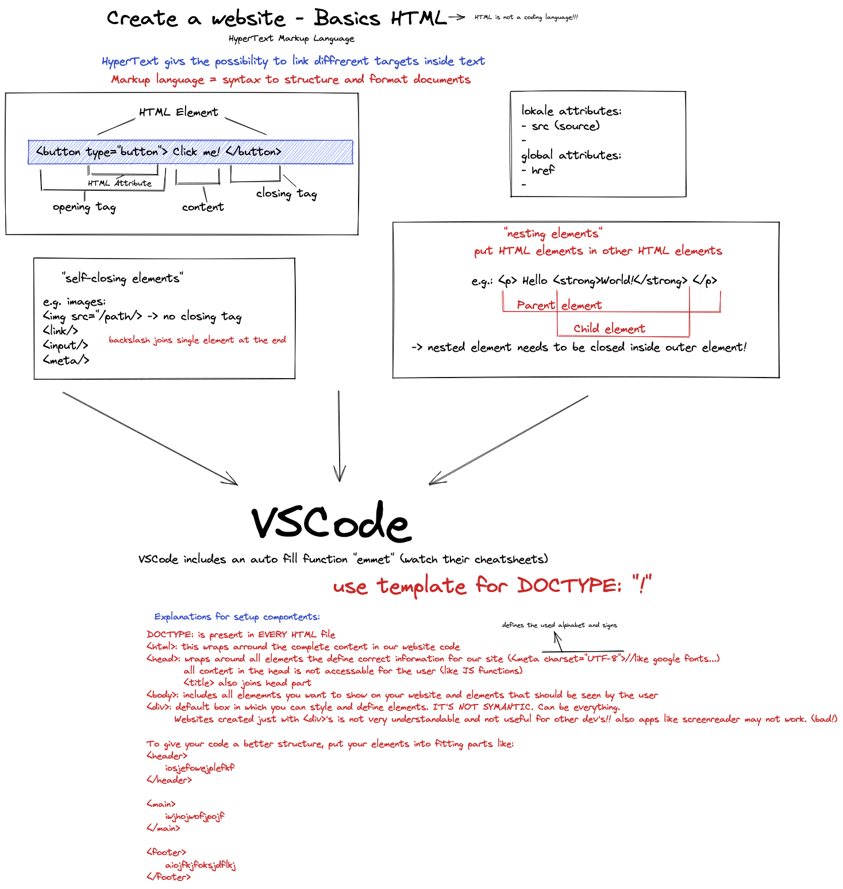

# HTML Basics

HTML (Hyper Text Markup Language) wird benutzt um Texte strukturiert. Mit HTML-Tags wird angegeben, um was für einen Inhalt es sich handelt.

- Bsp: Headline:
  `<h1>Headline</h1>`
  ***
  Die Headline steht zwischen einen **_opening Tag_** und einem **_closing Tag_**. Das alles wird als **_HTML Element_** bezeichnet. Durch das nesten von Elementen ineinander wird die Hierarchie strukturiert.

Es gibt auch HTML-Elemente, die **_self-closing_** sind. Sie benötigen keinen closing Tag. Sie werden auch **_empty elements_** genannt.

## HTML Tag attributes

Einige Elemente brauchen mehr Informationen, um zu funktionieren:

- Bildquelle: img src="URL" alt=""
- Link zum anchor-element: a href="URL"
- Type von einem Input element

## Layout von einem HTML document

Jedes HTML Dokument startet mit einem `Doctype`, gefolgt von einem `<html>`tag. Das HTML-Element enthält zwei wichtige Teile:

- `<head>` enthält die wichtigsten Meta-Informationen für den Browser

  - charset (utf-8)
  - favicon
  - Titel der Website
  - CSS & Javascript Dateien für die Website

- `<body>` enthält den sichtbaren Content der Website
  

## Struktur einer Website

Es gibt zwei Möglichkeiten, eine Website sinnvoll zu strukturieren:

- semantic HTML verwenden
- Nesting/grouping der HTML-Elemente

### Semantisches HTML

Semantische HTML Elemente unterteilen die Website ins sinnvolle Abschnitte und beschreiben gleichzeitig ihre Funktion oder Zweck.
Vorteil: Der Code wird verständlicher für andere Entwickler und Accessibility Tools und Suchmaschinen können die Website interpretieren.

### Nesting Elements

"Nesting" gruppiert Elemente sinnvoll. Die Elemente, die andere Elemente enthalten werden **parent element** genannt, die genesteten Elemente sind **child elements**.

