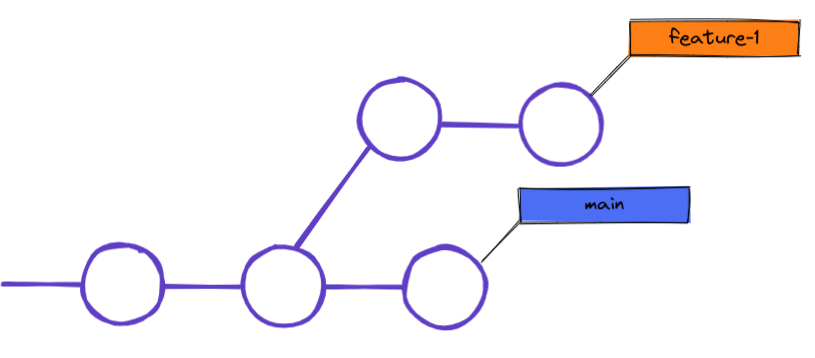

# Git Branches & Pull Requests

---

- Branches sind für unterschiedliche neue Features/ andere Änderungen (Fixes etc.)
  -> verschiedene Teams können an eigenen Branches an verschiedenen Sachen arbeiten
- Wenn die Änderungen abgeschlossen sind, kann der Branch zum Main gemerged werden -> der Merge zum Main Branch erfolgt über **Pull Requests** in GitHub --> Änderungen/ Code wird kontrolliert und dann für den Merge freigegeben
- durch Branches wird der Main nicht verändert und neue Features können ohne Auswirkungen getestet werden

## Pull Requests

Pull Requests (PR) ermöglichen das mergen von feature branches zum Main Branch. Weitere Personen überprüfen die Änderungen /Code und approven dann die PR, wenn es keine Fehler gibt. Erst dann kann der Feature Branch zum Main gemerged werden.

### Workflow für eine Pull Request

---
