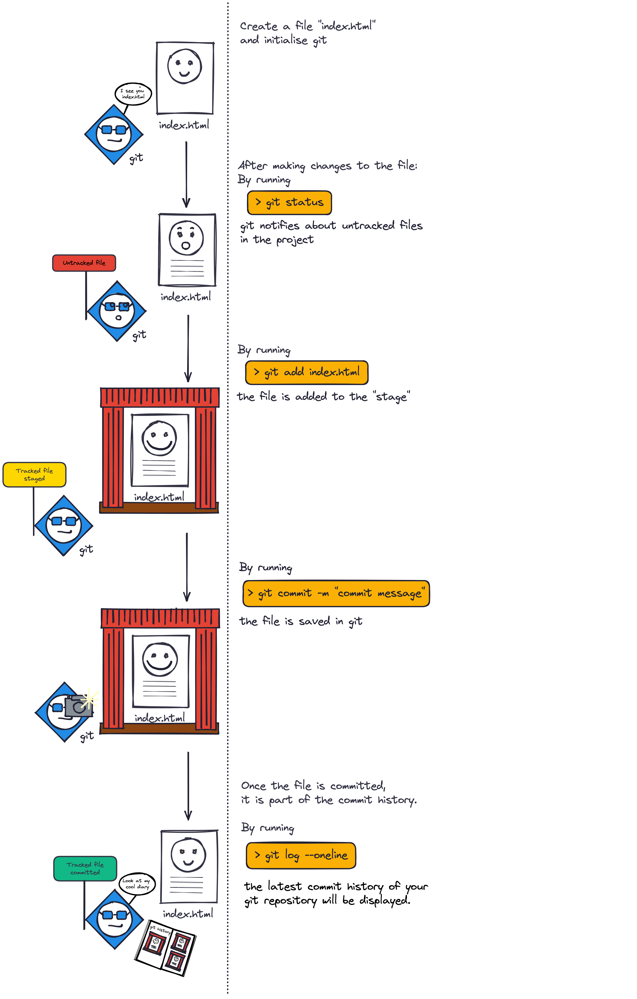

# Git & CLI Remote

Mit Git CLI kann man lokale Repositories und commits erstellen. Man kann die lokalen Repositories auch mit **remote Repositories** verknüpfen (z.B über GitHub).

## lokale Repositories anlegen

Um eine Datei zu einem Git Repository zu machen muss man folgenden Befehl eingeben:

```shell
cd path/to/my/folder
git init
```

Mit dem Befehl "git status" kann man prüfen, ob eine Datei schon ein Repository ist.

## File Status

### Untracked files

The file has not been added to git.

### Tracked files

Tracked files can be in different states:

| state     | description                        |
| --------- | ---------------------------------- |
| modified  | Has changes since the last commit  |
| staged    | Is included in the next commit     |
| committed | All changes have been saved in git |

---

## Commits im lokalen Repository

Die folgenden commands sollten nach jeder fertigen Aufgabe ausgeführt werden:
| Git command | Git task |
| -------------------------------- | ------------------------------------------------ |
| `git status` | List all files that have changed and their state |
| `git add <filename>` | Add a file to the stage |
| `git commit -m "Commit message"` | Create a commit including all staged files |
| `git log --oneline` | Show the commit history |

---

Commits können als Back-up genutzt werden.
Mit dem Befehl "git restore ." wird die aktuelle Datei auf den Stand des letzten commits zurückgesetzt.

---

## Mit einem remote Repository verknüpfen

Durch das Verbinden mit einem Repository können mehrere Personen gleichzeitig arbeiten. Das remote Repository kann auch als Back-up benutzt werden.

### Lokales Repository mit remote Repository verbinden

- Zuerst muss ein neues, leeres Repository auf GitHub erstellt werden.
- Dabei werden schon Vorschläge gemacht, diese kann man dann einfach anwenden. --> commands kopieren und im Terminal ausführen

### Remote repository klonen

Über GitHub kann man ein Repository klonen. Dafür klickt man auf Code und wählt dann clone aus (immer SSH URL verwenden!)

### GitHub Workflow:


